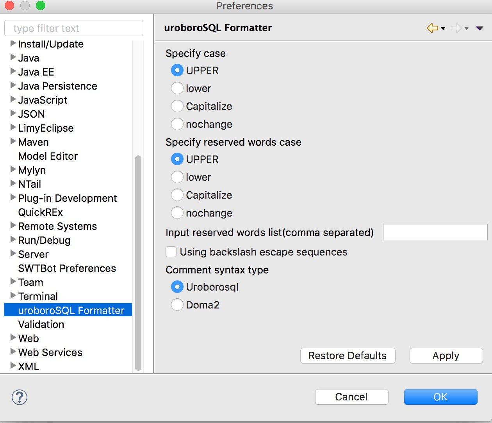

Eclipse uroboroSQL Formatter
=============================

[](https://marketplace.eclipse.org/content/eclipse-uroborosql-formatter)

uroboroSQL Formatterは、エンタープライズシステムで用いられることの多い、  
非常に長いSQL(1K step以上)でも見やすく保守性の高いスタイルへフォーマットするための  
Eclipseのプラグインです。

特に日本など、英語を母国語としない国では、SELECT句などにコメントを入れることがあります。  
その場合、AS句とコメントの縦位置を揃えて、もはや芸術的とも言える見やすさを追求しますが、  
これ自動的に実現するために開発したものです。

#### 一般的なフォーマッタの場合

```sql
SELECT MI.MAKER_CD AS ITEM_MAKER_CD -- メーカーコード
,
       MI.BRAND_CD AS ITEM_BRAND_CD -- ブランドコード
,
       MI.ITEM_CD AS ITEM_CD -- 商品コード
,
       MI.CATEGORY AS ITEM_CATEGORY -- 商品カテゴリ
FROM M_ITEM MI -- 商品マスタ

WHERE 1 = 1
  AND MI.ARRIVAL_DATE = '2016-12-01' -- 入荷日
```

#### uroboroSQL Formatterの場合

```sql
SELECT
    MI.MAKER_CD AS  ITEM_MAKER_CD   -- メーカーコード
,   MI.BRAND_CD AS  ITEM_BRAND_CD   -- ブランドコード
,   MI.ITEM_CD  AS  ITEM_CD         -- 商品コード
,   MI.CATEGORY AS  ITEM_CATEGORY   -- 商品カテゴリ
FROM
    M_ITEM  MI  -- 商品マスタ
WHERE
    1               =   1
AND MI.ARRIVAL_DATE =   '2016-12-01'    -- 入荷日

```

Install
-------

### Update site

Eclipseのメニューより、ヘルプ -> 新規ソフトウェアのインストールを選択し、下記URLを入力してください。

https://future-architect.github.io/eclipse-uroborosql-formatter/

その後、「Eclipse uroboroSQL Formatter」を選択してインストールしてください。

### Eclipse Marketplace

下記ボタンを実行中のEclipseワークスペースにドラッグしてください。

[](http://marketplace.eclipse.org/marketplace-client-intro?mpc_install=3434118 "Drag to your running Eclipse* workspace. *Requires Eclipse Marketplace Client")


Features
--------

-	SELECT句、WHERE句内でASや演算子の縦位置を揃えてフォーマット
-	各行の末尾にコメントがあっても正しくフォーマット

How to Use
----------

-	拡張子sqlのファイルを開いた状態で、Editメニューから「Format SQL」を選択
- 拡張子sqlのファイルを開いた状態で、エディタのコンテキストメニューより「Format SQL」を選択
-	Ctrl + Shift + L on Windows, Cmd + Shift + L on OS X

Preferences
-----------

- Eclipseの環境設定から「uroboroSQL Formatter」を選択



License
-------

[python-sqlparse library](https://github.com/andialbrecht/sqlparse) and this code are both on [2-clauses BSD](http://www.opensource.org/licenses/bsd-license.php)

---

Copyright 2018 by Future Architect.
